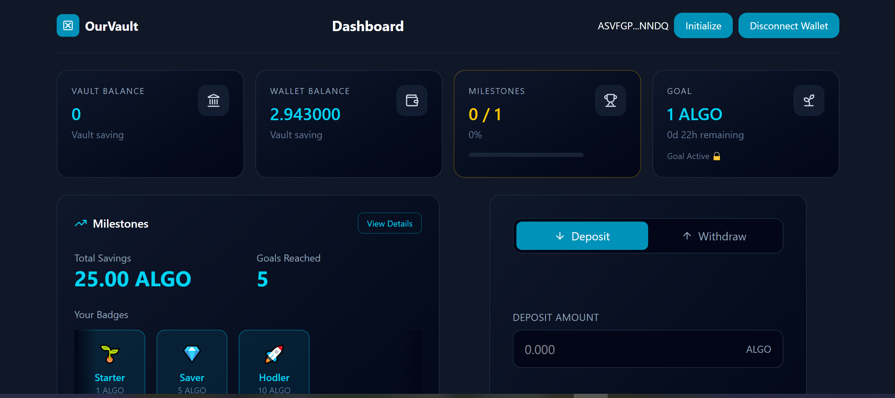

# 💰 OurVault (AlgoVault)
### Smart Goal-Based Savings on Algorand Blockchain

🚀 A decentralized savings vault that helps users build disciplined saving habits using blockchain-powered transparency and security.

---

## 📌 Problem Statement

Users often struggle to maintain consistent saving habits due to:
- Lack of structured saving tools  
- No accountability or commitment system  
- Poor progress tracking in existing apps  

As described in the Hackatron problem statement, the goal is to build a **wallet-linked savings vault on Algorand** that enables secure deposits and transparent tracking. :contentReference[oaicite:0]{index=0}

---

## 💡 Solution

**OurVault** solves this by turning saving into a **locked commitment system**:

- Users create savings goals with deadlines 🎯  
- Funds are deposited and tracked on-chain 💰  
- Active goals remain locked to prevent impulsive withdrawals 🔒  
- Progress and milestones are visible in real-time 📊  

👉 “We don’t just track savings, we enforce discipline.”

---

## ✨ Features

- 🔗 **Wallet Integration** (Algorand wallet connection)  
- 💰 **Secure Deposits** using blockchain transactions  
- 🎯 **Goal-Based Saving System**  
- 📊 **Progress Tracking Dashboard**  
- 🏆 **Milestone System & Badges**  
- 🔒 **Goal Lock Mechanism**  
- 📜 **Transaction History**  

---

## 🖥️ Dashboard Preview

> Clean UI showing vault balance, milestones, goals, deposits, and progress tracking.

---

## 🛠️ Tech Stack

- **Frontend:** React.js + Tailwind CSS  
- **Blockchain:** Algorand  
- **Development Tools:** AlgoKit  
- **Version Control:** Git & GitHub  

---

## ⚙️ How It Works

1. User connects Algorand wallet  
2. Creates a savings goal (amount + deadline)  
3. Deposits ALGO into vault  
4. Funds are recorded on-chain  
5. Dashboard tracks progress & milestones  
6. Withdrawal is restricted during active goals  

---

## 🔗 Blockchain Implementation

- Uses **Algorand local state** to track user savings  
- Uses **global state** for milestones  
- Implements **grouped transactions** (payment + app call)  
- Ensures **real-time on-chain data tracking**  

---

## 🚀 Future Scope

- 🤖 AI-based saving recommendations  
- 👥 Group savings / shared goals  
- 📱 Mobile application  
- 📈 Advanced analytics & insights  

---

## 🎯 Impact

- Encourages disciplined financial habits  
- Provides transparency through blockchain  
- Scalable solution for real-world fintech   

---

## 📢 Final Note

> “Saving money is hard. OurVault makes it inevitable.”